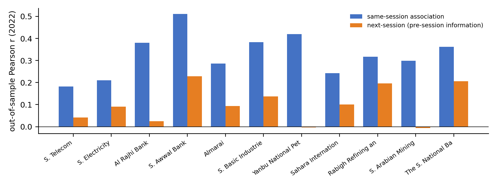

# Reversed Sentiment Analysis

Research code, notebooks, and supplementary outputs for a study of Arabic financial-news signals and Saudi-listed companies. The repository implements two reversed-sentiment estimators—an equal-split lexicon and a ridge/TF-IDF lexicon—and evaluates same-session association, next-session prediction, walk-forward stability, placebos, timing, horizons, robustness, transfer, benchmarks, and a trading exercise.

> **Research status:** companion repository for a revised manuscript. The saved outputs are complete, but a fresh run requires the three source CSV files described in [`data/README.md`](data/README.md). Raw news text is not committed because redistribution rights have not been documented.

## Main result

Using a pooled ridge lexicon trained on 2018–2021 data and frozen for 2022:

| Evaluation | n | Pearson r | Newey–West t | Balanced accuracy | AUC |
|---|---:|---:|---:|---:|---:|
| Same-session association | 1,535 | 0.326 | 12.460 | 0.597 | 0.653 |
| Next-session, pre-session information | 1,521 | 0.112 | 4.463 | 0.545 | 0.550 |

The predictive effect is modest but positive. It is concentrated at session +0 and does not persist consistently at later horizons. The saved trading exercise is not profitable after transaction costs, so these results should not be interpreted as investment advice.



## Repository contents

```text
.
├── notebooks/
│   ├── reversed-sentiment-paper-results.ipynb
│   └── archive/initial_multicompany_analysis.ipynb
├── src/generate_paper_results.py
├── data/README.md
├── results/
│   ├── README.md
│   └── paper_outputs/             # 12 tables, 2 lexicons, key numbers, 10 figures
├── docs/
│   ├── METHODS.md
│   ├── NOTEBOOK_AUDIT.md
│   └── REPRODUCIBILITY.md
├── scripts/validate_repository.py
├── requirements.txt
├── environment.yml
├── CITATION.cff
└── LICENSE
```

## Quick start

Python 3.11 or 3.12 is recommended.

```bash
python -m venv .venv
source .venv/bin/activate       # Windows: .venv\Scripts\activate
python -m pip install --upgrade pip
python -m pip install -r requirements.txt
```

Place the authorized source files in `data/raw/`:

```text
data/raw/Companies.csv
data/raw/AllNews.csv
data/raw/StockPrices.csv
```

Run the complete pipeline:

```bash
python src/generate_paper_results.py \
  --data-dir data/raw \
  --output-dir results/generated
```

Or open [`notebooks/reversed-sentiment-paper-results.ipynb`](notebooks/reversed-sentiment-paper-results.ipynb) and run all cells from top to bottom.

Validate the repository structure and saved artifacts:

```bash
python scripts/validate_repository.py
```

## Reproducibility notes

- The random seed is fixed at `0`.
- The main training window ends on 2021-12-31; the principal out-of-sample test year is 2022.
- Tadawul session hours are treated as 10:00–15:00 for 2018–2022.
- Predictive alignment assigns an article to the first market session that opens after publication.
- The notebook was originally executed under Python 3.12.4. Package compatibility ranges are recorded in `requirements.txt`.
- The final supplementary ZIP and the saved notebook tables agree on the reported main results.
- A clean rerun on 2026-09-16 completed successfully; all table shapes and labels matched, with maximum numeric drift below 0.0012 under newer compatible libraries.

See [`docs/REPRODUCIBILITY.md`](docs/REPRODUCIBILITY.md) for a full rerun checklist and [`docs/NOTEBOOK_AUDIT.md`](docs/NOTEBOOK_AUDIT.md) for the repository review.

## Data and licensing

The source archive contains full Arabic news text and market data. Those raw files are intentionally excluded from version control until the owner verifies the original providers' redistribution terms. Derived tables, figures, and lexicons are included. The MIT license applies to the code and documentation in this repository; it does not grant rights to third-party source data or article text.

## Citation

Use the repository's **Cite this repository** control, backed by [`CITATION.cff`](CITATION.cff). Update the manuscript title, co-authors, DOI, and release version before making the repository public or archiving it with Zenodo.

## Contact

Naveed Ahmad — `nahmed@psu.edu.sa`
